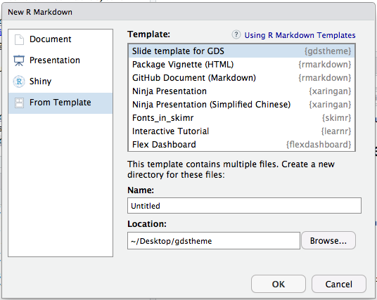

# gdstheme

[](https://www.tidyverse.org/lifecycle/#experimental)

# tl;dr

An R package containing a [Xaringan](https://github.com/yihui/xaringan) presentation template in the style of the the UK's [Government Digital Services](https://gds.blog.gov.uk/) theme.

See [a live template example](https://matt-dray.github.io/gdstheme/) and [read a blog post about its development](https://www.rostrum.blog/2019/05/24/xaringan-template/). 

# Purpose

This package provides an unofficial, unbranded template that mimics the style of slides at [Government Digital Service](https://www.gov.uk/government/organisations/government-digital-service) (GDS), part of the UK's [Cabinet Office](https://www.gov.uk/government/organisations/cabinet-office).

You can use it to integrate easily the outputs of R code with your slides to help make them more reproducible.

The template requires the [{xaringan}](https://github.com/yihui/xaringan) package by [Yihui Xie](https://yihui.name/), which provides an implementation of [remark.js](https://github.com/gnab/remark) through R Markdown.

# Install

```{r}
# install.packages("remotes")
remotes::install_github("matt-dray/gdstheme")
```

To open the template in RStudio, go to `File` > `New File` > `RMarkdown...` > `From Template` > `Slide template for GDS`



You can also use the `draft()` function from the {rmarkdown} package:

```{r}
rmarkdown::draft(
  file = "doc_name.Rmd",
  template = "gdstheme",
  package = "gdstheme"
)
```

# Reference

## Classes

These classes should be specified at the top of each slide.

| Code | Class description | Example |
| :- | :- | :- |
| `class: title-slide, bottom` | Title slide class (text at bottom) | [Title slide](https://matt-dray.github.io/gdstheme/#1) |
| `class: inverse, middle` | Text heading slide class (text in the middle) | [Heading slide](https://matt-dray.github.io/gdstheme/#2) |
| `class: inverse, middle`<br>`background-image: url("path/to/image.jpg")`<br>`background-size: cover` | Text heading slide class (text in the middle) with background image | Image heading slide [with text](https://matt-dray.github.io/gdstheme/#3) and [without](https://matt-dray.github.io/gdstheme/#6) |
| [blank] | The regular text slide class is the default and doesn't need to be declared | [A text slide](https://matt-dray.github.io/gdstheme/#4) |

## Helpers

These are useful snippets that can help transform elements on the page.

| Code | Purpose | Example |
| :- | :- | :- |
| `.bold[Text]` | Makes text bold | ['Firstname Lastname' on title slide](https://matt-dray.github.io/gdstheme/#1) |
| `.black[Text]` | Makes text black (use for contrast on heading slides) | [Text on heading slide](https://matt-dray.github.io/gdstheme/#3) |
| `.pull-left[Content]` | Content in left half of slide only | [Text on this slide](https://matt-dray.github.io/gdstheme/#7) |
| `.pull-right[Content]` | Content in right half of slide only | [Image on this slide](https://matt-dray.github.io/gdstheme/#7) |

# Contribute

Please feel free [leave an issue](https://github.com/matt-dray/gdstheme/issues). Please follow [the code of conduct](https://github.com/matt-dray/gdstheme/blob/master/CODE_OF_CONDUCT.md).